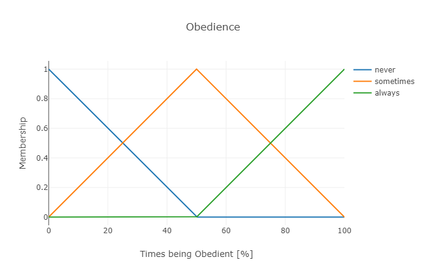
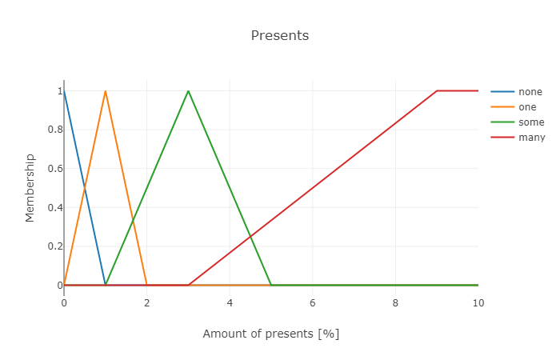
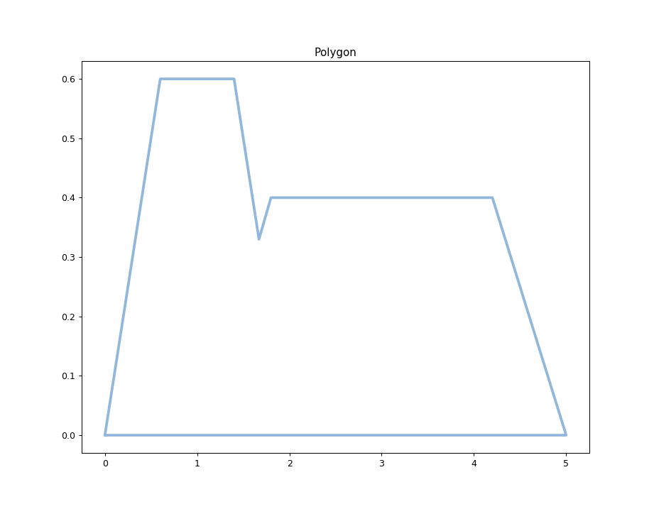

# Introduction to Symbolic AI  Tasks WS 2018/19

Kevin Schneider (389667)  
Heinrich Lukas Weil (389347)  # Introduction to Symbolic AI  Tasks WS 2018/19

Kevin Schneider (389667)  
Heinrich Lukas Weil (389347)  

## Task 1 -

- When was the DFKI founded?
    http://dbpedia.org/page/German_Research_Centre_for_Artificial_Intelligence
    owl:sameAs -> wikidata:Deutsches Forschungszentrum für Künstliche Intelligenz
        inception -> 1988

- How many people work at DFKI?
    http://dbpedia.org/page/German_Research_Centre_for_Artificial_Intelligence
    Could not find this piece of information precedented by an proper RDF predicate.
    It is neither listed on dbpedia nor wikidata and the links to other datasets don't work.

- What cities does the DFKI operate in??
    http://dbpedia.org/page/German_Research_Centre_for_Artificial_Intelligence
    owl:sameAs -> wikidata:Deutsches Forschungszentrum für Künstliche Intelligenz
        located in the administrative territorial entity ->	[Saarbrücken;
                                                            Bremen;
                                                            Berlin;
                                                            Kaiserslautern]

## Task 2 -

(a)

Predicate logic requires high level of knowledge/certainty about the system. Very often, this certainty is not possible to obtain.

With fuzzy logic, computers can instead make decisions based on uncertain information, bypassing this problem.

(b)

- **measured variables:**

    measured variables are the values you measure and cannot control

- **controlled variables:**

    controlled variables are the values you can control

- **fuzzy sets, values and membership functions:**
    A fuzzy set is a set of elements for whom a degree of membership to this set is given.
    This degree of membership is calculated by applying the membership function of the set on the values the element.
    Membership functions can return a degree between 0 and 1.

- **fuzzy rules:**
    fuzzy rules are logical inference rules, where the input and the output don't have to be true or false but can be values between 0 and 1

- defuzzification:
    Defuzzification is the process of transforming fuzzy sets into a crisp result.

    Given a fuzzy control system, the measured values of measured variables are transformed using membership functions and integrated in fuzzy sets. The inference engine processes these fuzzy sets via fuzzy rules. The resulting set is defuzzified and a control variable is returned.

(c)

- Define relevant measured and control variables.

- Model fuzzy sets and membership functions for the measured values

- Set up rules

- Define a defuzzification method for returning a crisp value

## Task 3 -

(a)

    Define T,C = {H,RH,M,RL,L}
    Define dT = {I,S,D}

    if T = H  & dT = I then
        C = L

    if T = RH & dT = S then
        C = RL

    if T = M & dT = S then
        C = M

    if T = RL & dT = D then
        C = RH

    if T = L & dT = D then
        C = H

(b)

(c)

Applying the rules lead to memberships of C:

    L(C)    = 0.0
    RL(C)   = 0.0
    M(C)    = 0.2222222222222222
    RH(C)   = 0.6493506493506493
    H(C)    = 0.2

**MinMax:**

MinMax inference leads to a centroid at an approx. temperature value of 33,5°C.

## Task 4 -

(a)

Measured variables:

    How often does the child obey its parents
    set O = {Never, Sometimes, Always}

    How often does the child do its homework
    set H = {Never, Sometimes, Always}

Controlled variable:

    Amount of presents
    set P = {None, 1, Some, Many}

(b)

    if O = Never & H = Never then
        P = None
    if O = Sometimes & H = Sometimes then
        P = 1
    if O = Always & H = Sometimes then
        P = Some
    if O = Always & H = Always then
        P = Many

(c)

images:

(d)

    Listen to Parents: {
        membership(Never) = 0
        membership(Always) = 0.4
        membership(Sometimes) = 0.6
    }

    Homework: {
        membership(Never) = 0
        membership(Always) = 0
        membership(Sometimes) = 1
    }

    Presents: {
        membership(None) = 0
        membership(1) = 0.6
        membership(Some) = 0.4
        membership(Many) = 0
    }

**MinMax:**

This results in 2.26 presents as the x-value of the centroid.

## Task 5 -

See Exercise_4_KevinSchneider_LukasWeil.py