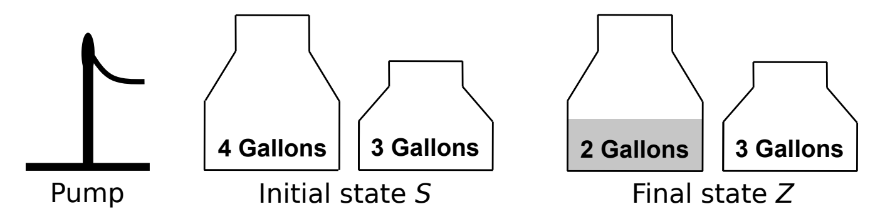
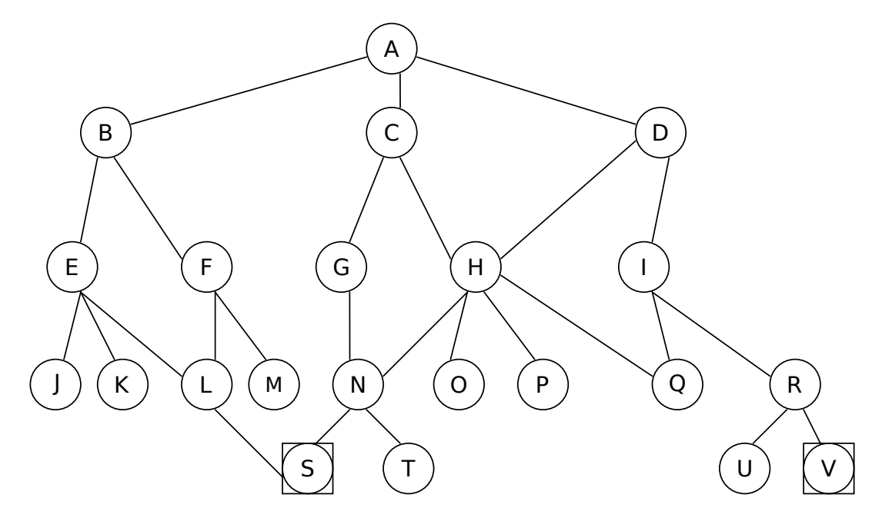
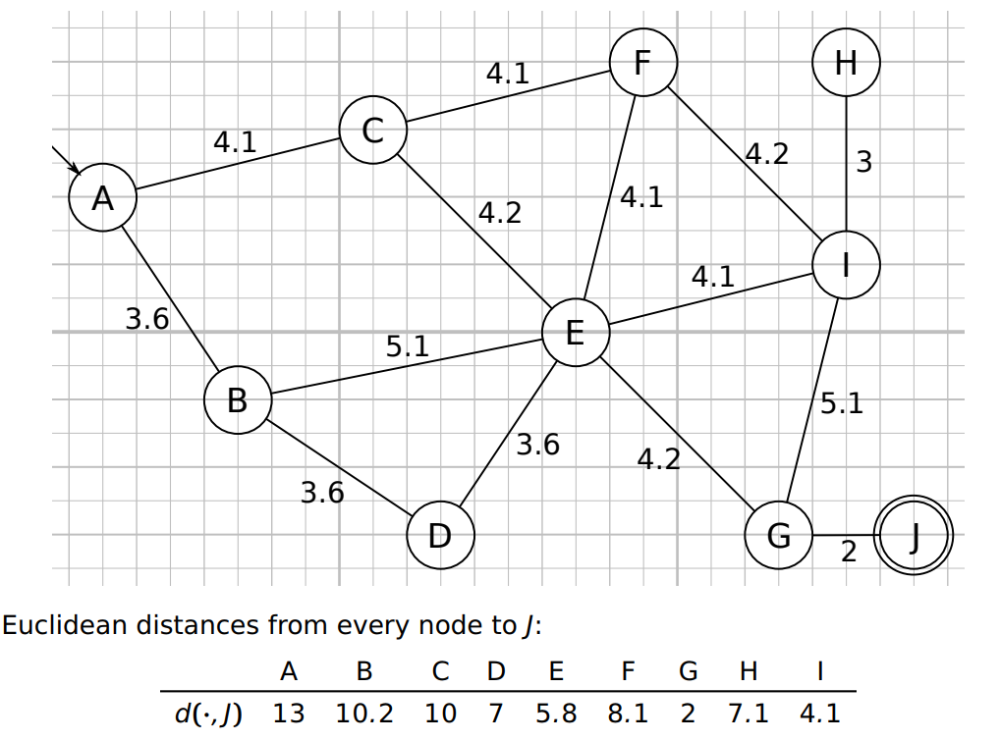
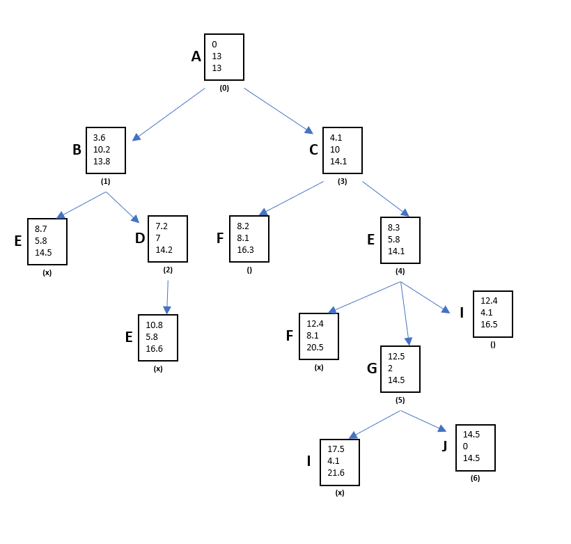

# Introduction to Symbolic AI  Tasks WS 2018/19

Kevin Schneider (389667)  
Heinrich Lukas Weil (389347) 

## Task 1 - Water Jug Problem

The image below describes the water jug problem from the lecture. Its goal is
to get from the initial state (S, both jugs empty) to the final state (Z, 2 gallons
of water in the large jug and small jug empty) by applying a chain of allowed
actions (transitions).

(a) Formally define the state space K of the problem give and give S, Z ∈ K.
Assume that jugs can only hold  ∈ N0 gallons up to their capacity.
(b) Formally define all unambiguous transitions as mathematical functions
(i.e., ". . . pour some water . . . " has multiple outcomes, so it cannot be
defined as a function). It should also not be possible to apply transitions
that don’t alter the current state (like emptying an empty jug). Specify the
applicable value range for each function as cases with appropriate conditions, e.g.:

_e_4(x,y)= { (0,y), if x<0 (empty)

(a)

    x = amount of water in the 4-Gallons jug

    y = amount of water in the 3-Gallons jug

    K = (x,y) | x ? {0, 1,2,3,4}, y ? {0,1,2,3}

    S = (0,0)

    Z = (2,0)

(b)

    f3(x,y) = {(x, 3), if y < 3 (fill 3G)
    f3(x,y) = {(4, y), if x < 4 (fill 4G)
    e3(x,y) = {(x, 0), if y > 0 (empty 3G)
    e4(x,y) = {(0, y), if x > 0 (empty 4G)

## Task 2 - Search complexity

Theoretical analysis can be very useful to choose the best search method
given the constraints of a specific application and environment.
a) Define "optimal" and "complete" in the context of search methods.

>complete:   a search method is described as being complete if it is guaranteed to find a goal state if one exists, and if the state space is finite.
 
>optimal:    When there are multiple solutions to the problem, the search method finds the best solution (or one of the best if there are multile best solutions) given a criterium to categorize the "goodness" of a solution (e.g. traversal cost)

b) Explain why the following statements hold:

* Breadth-First Search (BFS) has exponential space complexity in depth.

>Since all of the nodes of a level must be saved until their child nodes in the next level have been generated, the space
complexity is proportional to the number of nodes at the deepest level. Given a branching factor **_b_** and graph depth **_d_**
the asymptotic space complexity is the number of nodes at the deepest level, **_O(bd)_**, and therefore exponential in depth

* Depth-First Search (DFS) is not optimal and not complete, but Iterative Deepening DFS (IDS) is.

>Depth-first search isn't guaranteed to halt on graphs with cycles. However, DFS is complete for finite acyclic graphs.
It can “stumble” on longer solution paths before it gets to shorter ones and is therefore not optimal.
 
>The depth limitation of IDS at each step of the performed DFS guarantees to find the most shallow solutions (unlike pure DFS which doesn't) and is therefore optimal.
This also means that it never ends up exploring along infinite dead-end paths, since the length of each path is capped by some length at each step, and it is therefore complete

c) Give formulas based on depth d and branching factor b of a regular tree
for the worst-case number of nodes visited by BFS and IDS. What is the
overhead of IDS over BFS?

>BFS: O(db)
 
>IDS: O(db)
 
> In both cases, the worst case is if the goal is at maximum depth and the respective last child in all child lists of the graph. The advantage of IDS is the lower memory consumption:
> At any time IDFS needs to store only the nodes in the branch it is expanding (O(db)), whilde BFS has to store all nodes in the worst case (O(db))

## Task 3 -

The following search tree is given.

a) Find S and V. List the sequence of nodes visited along the way using:

_NOTE: we assume that the children of nodes are listed in alphabetical order, eg, B is the first child of A_

Breadth-First Search (BFS)

>For **S** : A-B-C-D-E-F-G-H-I-J-K-L-M-N-O-P-Q-R-**S**
 
>For **V** : A-B-C-D-E-F-G-H-I-J-K-L-M-N-O-P-Q-R-S-T-U-**V**

Depth-First Search (DFS)

>For **S** : A-B-E-J-K-L-**S**
 
>For **V** : A-B-E-J-K-L-S-F-M-C-G-N-T-H-O-P-D-I-Q-R-U-**V**

Iterative Deepening Depth-First Search (IDS)

>For **S** (Complete sequence of visited notes is all depth sequences combined): 
   >
   > l = 1; A-B-C-D-
   >
   > l = 2; A-B-E-F-C-G-H-D-I
   >
   > l = 3; A-B-E-J-K-L-F-M-C-G-N-H-O-P-D-I-Q-R
   >
   > l = 4; A-B-E-J-K-L-**S**
 
 
>For **V** (Complete sequence of visited notes is all depth sequences combined): 
   > l = 1; A-B-C-D-
   >
   > l = 2; A-B-E-F-C-G-H-D-I
   >
   > l = 3; A-B-E-J-K-L-F-M-C-G-N-H-O-P-D-I-Q-R
   >
   > l = 3; A-B-E-J-K-L-S-F-M-A-C-G-N-T-H-O-P-D-I-Q-R-U-**V**

b) What is the outcome of Limited Depth-First Search for different limits?

>See above.

## Task 4 -

The following map is given. Paths are bidirectional

a) Use the A* search algorithm to find the lowest-cost route from node A to J,
with traversal costs on the map as actual cost and euclidean distance for
estimated remaining cost. Create a search tree in the following notation:

B marks the node. (1) is the sequence number. Numbers from top to bottom are: traversal cost up to this point, estimated remaining cost, combined cost.
When you reach a node that is already in the tree and it is not cheaper to
reach now, mark this new node with × in place of a sequence number and
ignroe it.

b) Give the optimal path from A to J with total traversal cost.

>A-C-E-G-J with total cost of 16.5

## Task 5 -

see "Exercise_5_KevinSchneider_LukasWeil.py"