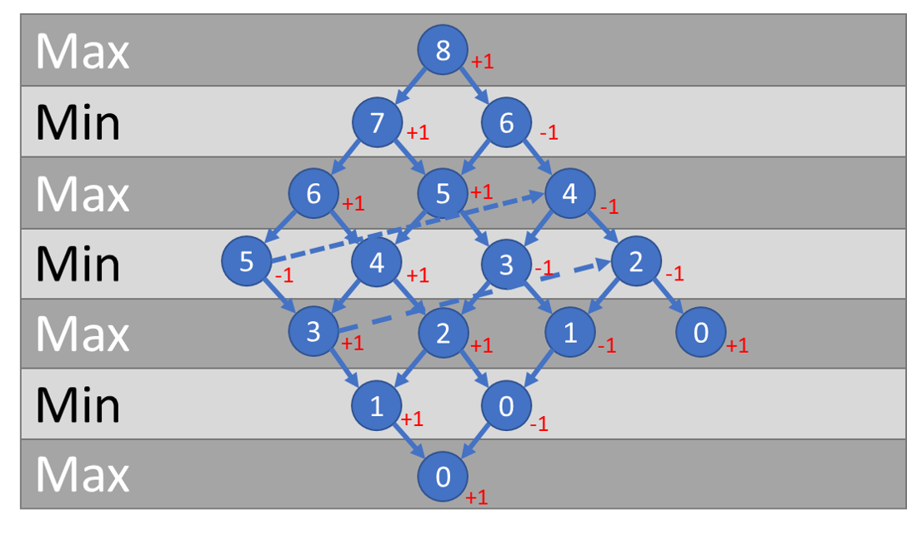
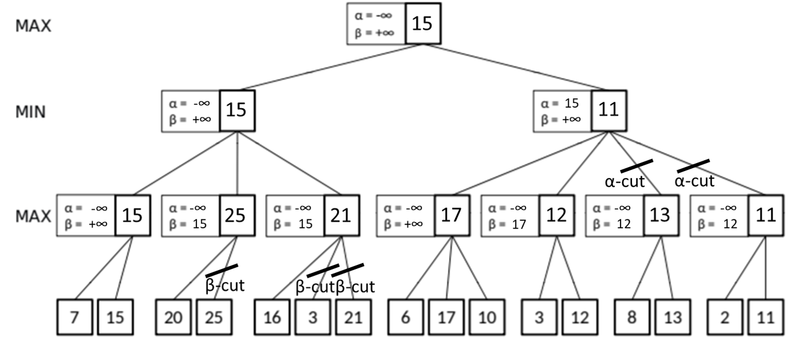

# Introduction to Symbolic AI  Tasks WS 2018/19

Kevin Schneider (389667)  
Heinrich Lukas Weil (389347)  # Introduction to Symbolic AI  Tasks WS 2018/19

Kevin Schneider (389667)  
Heinrich Lukas Weil (389347)  

## Task 1 -

## Task 2 -

## Task 3 -

a)b)

c) Under these circumstances Player Max will always win.
## Task 4 -

## Task 5 -